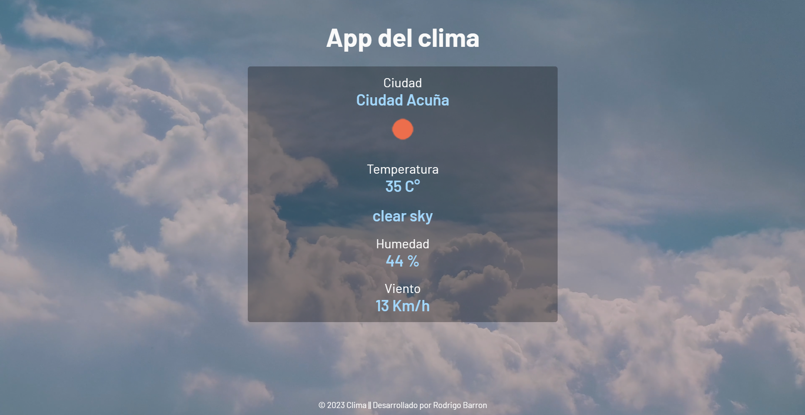

# Aplicacion del clima

En este repositorio se tiene una página utilizando una API del clima de [OpenWeather](https://openweathermap.org/api)

## Vista previa de la página web

Puedes visitar la pagina en el siguiente link ➡️ [Click Aqui](https://weather-app-rodbame.vercel.app/) ⬅️

Para el correcto funcionamiento de la aplicacion se necesita tener activada la ubicacion y darle permisos al navegador para acceder a tu ubicación.

